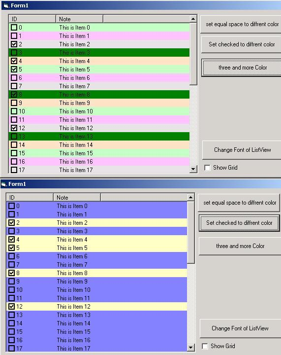



## a Sample method to set any Listitem of a listview with any color

### Description

Some articles in web just demonstrate how to set the bgcolor of a listitem with equal space,but some time ,we need set the color with the value of the listitem.

the following code demonstrate how can i do it.
 
### More Info
 

             |
---                |---
**Submitted On**   |2003-11-24 03:08:02
**By**             |[Nolan Shang](https://github.com/Planet-Source-Code/PSCIndex/blob/master/ByAuthor/nolan-shang.md)
**Level**          |Intermediate
**User Rating**    |4.7 (61 globes from 13 users)
**Compatibility**  |VB 6\.0
**Category**       |[Custom Controls/ Forms/  Menus](https://github.com/Planet-Source-Code/PSCIndex/blob/master/ByCategory/custom-controls-forms-menus__1-4.md)
**World**          |[Visual Basic](https://github.com/Planet-Source-Code/PSCIndex/blob/master/ByWorld/visual-basic.md)
**Archive File**   |[a\_Sample\_m16755511242003\.zip](https://github.com/Planet-Source-Code/nolan-shang-a-sample-method-to-set-any-listitem-of-a-listview-with-any-color__1-50078/archive/master.zip)

